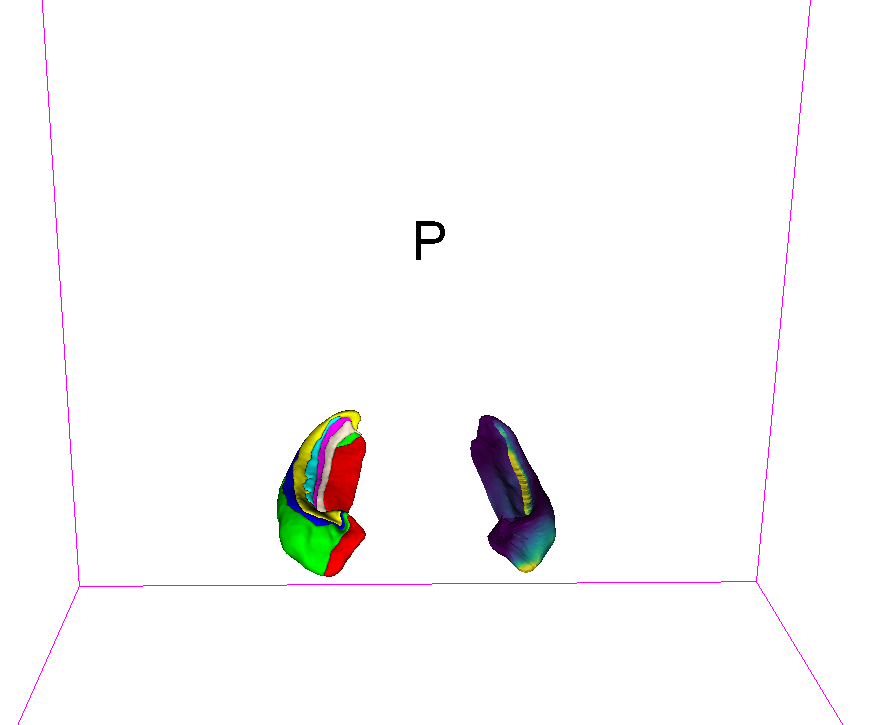
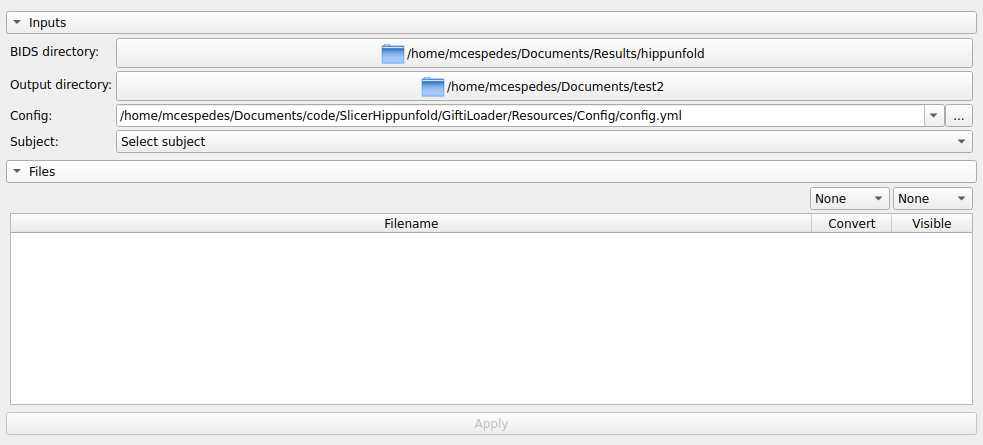
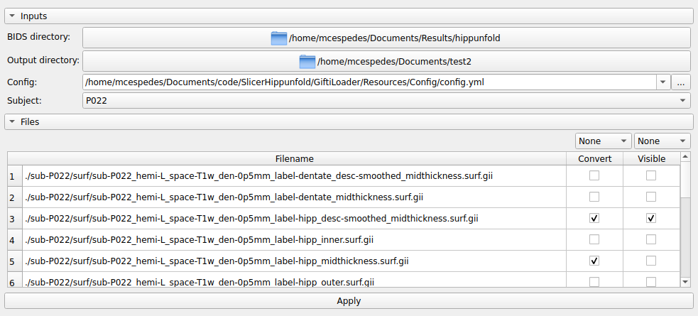

# Import Gifti files to 3D Slicer

This module loads gifti files from a [BIDS](https://bids.neuroimaging.io/) directory to 3D Slicer and saves them as vtk files in a specified folder. Multiple scalars can be attached to each mesh along with a color table as tsv file (which is optional). All of the information, except for the color table, for each mesh is saved into a new vtk file, which can be reloaded to 3D Slicer.

This tool was originally developed to import HippUnfold surfaces and volumes to 3D Slicer; however, it is able to load any other file with similar format. [PyBids](https://bids-standard.github.io/pybids/index.html) and [NiBabel](https://nipy.org/nibabel/index.html) were used to deal with the BIDS structure and nifti images respectively.

<p align="center"></p>

Some of the main features of this tool are:
* Works following the Brain Imaging Data Structure (BIDS) standard. By using PyBids, any BIDS directory can be parsed. The module will detect the subjects in the input directory, along with their corresponding files according to customizable filters from a configuration file.
* Gifti images can be loaded into 3D Slicer with the possibility of having multiple scalars attached to each surface. These models are saved, along with their corresponding scalars, using vtk files. 
* Nifti images can also be loaded along with a specified lookup table.

## Tutorial

Use the following instruction as a guide on how to use this module:

1. Click on the 3D Slicer 'Module Selection & Navigation' dropdown. Go to 'Utilities'->'ImportGifti'.
2. Select a valid BIDS directory as input and a valid output directory.

<p align="center"></p>

3. The configuration files will be automatically set to the default. This file only includes one dictionary called ``` pybids_inputs ```, which can have multiple entries that define the type of files that the module will be looking for. There are two types of entries:

   * Surfaces files (Gifti): these have the following inputs.
       * pybids_filters: dictionary that contains the filters passed to ``` BIDSLayout ``` from PyBids. Refer to the [documentation](https://bids-standard.github.io/pybids/examples/pybids_tutorial.html) from PyBids for more information. Example:
       ``` 
       pybids_filters:
         extension: '.surf.gii'
         space: 'T1w'
         suffix: ['inner','midthickness','outer']
       ```
       
       * scalars: dictionary that contains all of the different scalars that you want to attach to a specific group of surfaces (defined previously by the ``` pybids_filters ```). Each scalar has three entries: 
           * 'pybids_filters': defines the filters to look for the scalar files.
           * 'match_entities': can be used to retrieve only those files that match specific entities with the surfaces files, for example, only those scalars that all have the same 'task' entity as the surfaces files.
           * 'colortable': indicates the lookup table that is used to defined the colors of the surface using for the current scalars. This colortable has to have at least the following columns: index, r, g, b. Similar to the ones located under ``` ImportGifti/Resources/Data ```. Two colortables are provided under the aforementioned directory, one for Freesurfer segmentations and one for HippUnfold segmentations. The path can be absolute or relative to the file ``` ImportGifti.py ```.
       
          For example, the following input will look for two different 'types' of scalars ('labels' and 'shapes'). 'labels' is defined by those files in the same BIDS directory as the input with extension '.label.gii' that have the same value as the input files for the entities 'label' and 'hemi'; these type of scalar is associated to a colortable as well. The scalars defined by 'shapes' are not associated to a colortable.
       ``` 
       scalars:
         labels:
           pybids_filters:
             extension: '.label.gii'
           match_entities: ['label', 'hemi']
           colortable: '/home/mcespedes/Documents/code/SlicerHippunfold/ImportGifti/Resources/Data/desc-subfields_atlas-bigbrain_dseg.tsv'
         shapes:
           pybids_filters:
             extension: '.shape.gii'
           match_entities: ['label', 'hemi']
       ``` 
   * Volumetric segmentations (Nifti files):
      * pybids_filters: dictionary that contains the filters passed to ``` BIDSLayout ``` from PyBids. Similar to the previous case
      * colortable: Path to lookup table with the labels and colors associated to the labels (values) of each voxel. This colortable has to have at least the following columns: index, name, abbreviation, r, g, b, a. Similar to the ones located under ``` ImportGifti/Resources/Data ```. Two colortables are provided under the aforementioned directory, one for Freesurfer segmentations and one for HippUnfold segmentations. The path can be absolute or relative to the file ``` ImportGifti.py ```.
      * show_unknown: boolean that defines whether unknown regions (not found in the lookup table) should be displayed or not. Defaults to False. 
  
   This config files includes several predefined options under ``` pybids_inputs ```:

   * [HippUnfold](https://hippunfold.readthedocs.io/en/latest/) surfaces. Active by default.
   * [HippUnfold](https://hippunfold.readthedocs.io/en/latest/) volumetric segmentations (Nifti files). Active by default.
   * [fMRIPrep](https://fmriprep.org/en/stable/) surfaces. Unactive by default.
   * [FreeSurfer](https://surfer.nmr.mgh.harvard.edu/) volumetric segmentations. Unactive by default.
  
   You can comment/uncomment any section to activate/desactivate each filter repectively. You can also create a copy of this file and modify it as you like. Then only change the path in the UI (Config) to point to your file.

4. After setting the config file and input and output directories, click on the ``` Search subjects ``` button. You should be able to see a dropdown of the subjects present on the input BIDS directory under the 'Subject' dropdown. Choose one of the subjects.

5. After choosing, the files related to that subject will appear under 'Files' and the 'Apply' button will be enabled. Use the 'Convert' checkbox to choose which files to process and the 'Visible' checkbox to decide which files to show on the 3D View. The dropdown above each column can be used to select all the files at ones or to uncheck them all.

<p align="center"></p>

6. Hit the 'Apply' button to process the selected files. Give it a few minutes to see the results.

## Notes

Some important details to keep in mind:

* The input directory have to be in a BIDS compliant, as PyBids is used to retrieve the files.
* You cannot set a file 'Visible' without marking the 'Convert' checkbox first.
* The scalars have to come from a gifti file that defines a label (number) for each point in the mesh.
* Please report any issues to this repository.

## Contributors

Mauricio Cespedes (Western University), Greydon Gilmore (Western University).

## Acknowledgements

This work was supported by Canada Foundation for Innovation (CFI) John R. Evans Leaders Fund project #37427, Canada Research Chairs 950-231964, Canada First Research Excellence Fund and a Brain Canada Platform Support Grant.