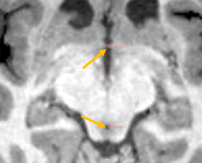

# ACPC Transform

## Overview

Calculate a transformation that aligns brain images to <a href="https://en.wikipedia.org/wiki/Talairach_coordinates">Talairach coordinate system</a> (also known as stereotaxic or ACPC coordinate system) based on anatomical landmarks.

The ACPC line extends between two points, one at the anterior commissure and one at the posterior commissure. The resulting transform will bring the line connecting the two points horizontal to the AP axis.

The midline is a series of points (at least 3) defining the division between the hemispheres of the brain (the mid sagittal plane). The resulting transform will result in the output volume having the mid sagittal plane lined up with the AS plane.

Use <b>Resample Scalar/Vector/DWI Volume</b> to apply the transformation to a volume.

## Tutorial

### Compute ACPC transform

- Begin by opening the `ACPC Transform` module. In `Input landmarks` section, click on the `ACPC Line` selector and select `Create a new markups line`.
- Use this line to define the posterior border of the anterior commissure as well as the anterior border of the posterior commissure in the axial slice. To place a line end-point, click `Place` button on the toolbar then click in the image. Click on a point to show it in all slice views. You will need to toggle between slices before you place the second point to do this. Verify in the sagittal slice that this line is accurate.

- To create the midline, click on the `Midline` selector and select `Create New MarkupsFiducial` from the dropdown.
- Select at least 5 points along reliable midline structures, (e.g. third ventricle, cerebral aqueduct, etc) ideally on different slices.

- Click on `Output transform` selector and choose `Create New Transform`, and then click `Apply` to compute the transform.

### Apply the computed transform to a volume

- Option A: Change image orientation information in the image header (image data is not changed, therefore there is no image quality loss):
  - Open `Data` module to navigate to the Subject hierarchy.
  - Right-click on the `Transform` column of your original MRI scan and select `Output transform`.
  - Right-click there again and select `Harden transform` to permanently modify the image with this transform.

- Option B: Resample the volume to align the voxel array's axes with ACPC axes (it is useful if the image needs to be segmented or processed along ACPC axes directions, but may result in slight image quality degradation). Go to `Resample Scalar/Vector/DWI Volume`, then choose:
  - `Input volume` -> original volume
  - `Output Volume` -> create a new volume node
  - `Reference volume` -> the original volume (should work well if `Center volume` option is disabled) or a standard Talairach volume (recommended if `Center volume` is enabled). Alternatively, output volume geometry can be specified using `Manual Output Parameters` section.
  - `Transfrom Node` output transform of ACPC module as

## Panels and their use

### Input landmarks

Anatomical landmarks that will be used for computing the ACPC transform.

- **ACPC line** (*ACPC*): ACPC line, connecting a point at the anterior commissure with a point at the posterior commissure.
- **Midline** (*Midline*): The midline is a series of points (at least 3) placed on the mid sagittal plane, defining the division between the hemispheres of the brain.

### Output transform

Computed transformation (rigid translation and rotation) that the module computes from the input landmarks. If this transformation is applied to the volume then it will make the ACPC line "horizontal" (be in AP axis of the patient coordinate system), line up the mid sagittal plane "vertical" (fit on the AS plane of the patient coordinate system), and (if centering is enabled) then make the AC point the origin (the (0,0,0) coordinate in the patient coordinate system).

- **Center volume** (*centerVolume*): If this option is enabled then the output transform will translate the AC point to the origin. If this option is disabled then the position of the volume will be preserved and transform will only change the orientation.
- **Output transform** (*OutputTransform*): Transform that moves the volume to standard ACPC coordinate system.

## Contributors

Nicole Aucoin (SPL, BWH), Ron Kikinis (SPL, BWH)

## Acknowledgements

This work is part of the National Alliance for Medical Image Computing (NAMIC), funded by the National Institutes of Health through the NIH Roadmap for Medical Research, Grant U54 EB005149.

